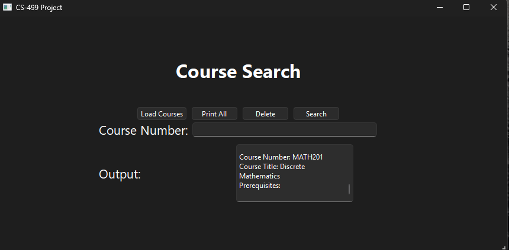
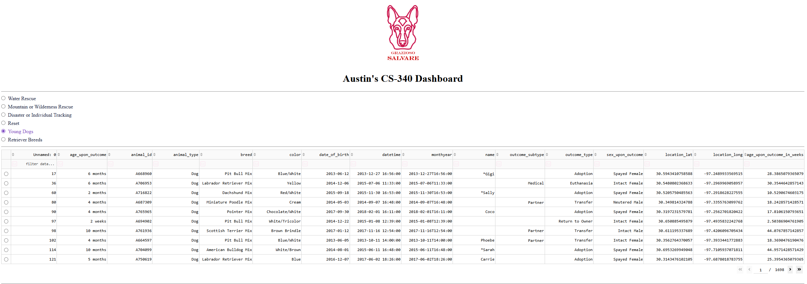

<h1 align = "center">
  Austin Ketron ePortfolio
</h1>

<h2 align = "center"><u>Code Review</u></h2>
 

  <iframe width="560" height="315" src="https://www.youtube.com/embed/JAYaiM7xcyc?si=SRxu1QoPhSj2C8RH" title="YouTube video player"        frameborder="0" allow="accelerometer; autoplay; clipboard-write; encrypted-media; gyroscope; picture-in-picture; web-share" referrerpolicy="strict-origin-when-cross-origin" allowfullscreen></iframe>

<h2 align = 'center'><strong>Enhancement One: Software Design and Engineering</strong></h2>

You can view the original code <a href = 'https://github.com/aketronEdu/CS-300'>here.</a>

 

  

The CS-300 Data Structures and Algorithms project involved creating a basic program that used a search algorithm to return course information for student advisors. I created the original code for the project in February of 2025. I chose this artifact because I wanted more experience in creating GUI’s and data structures and algorithms. I took the original CLI-based program and created a basic GUI using Qt, a GUI development framework. It shows that I can take existing code and rewrite it so it functions correctly for a different use case, while also applying data structures and algorithms in a more user-friendly way. I believe I met all of the course outcomes that I planned; which were the first, second, and third outcomes, by designing an efficient program, working with data structures, and improving usability.

  
I didn’t have too much trouble creating this enhancement, most of my trouble was figuring out how to make my existing code work with Qt. The buttons were the main trouble point, I had to add or rewrite code so that it would update the UI after I clicked them. In the original code, all of these updates were just printed on the command-line, so I had to adapt that logic to fit an event-driven system. I have some experience converting CLI-based programs into GUI programs from a few personal projects I've done. In those instances, though, I was using Python and Tkinter. So, it was interesting learning more about Qt since it’s a little more involved than Tkinter, and it helped me build on my problem-solving and programming skills.

<h2 align = 'center'><strong>Enhancement Two: Algorithms and Data Structures</strong></h2>

You can view the original code <a href = 'https://github.com/aketronEdu/CS-300'>here.</a>

 

This artifact was also used for enhancement one.

 

For this enhancement, I used the same artifact that was used in the previous milestone. It was from CS-300, and the purpose of the program was to allow advisors to load, search, and delete data for different courses. It was originally created in February 2025. To do so, it uses a Binary Search Tree (BST) and iterative algorithms. I chose this artifact again because it was a good opportunity to improve my knowledge of data structures and algorithms, and further develop my ability to work with different algorithm approaches.

  

The primary enhancement for this artifact was converting the existing recursive algorithms over to iterative. I also implemented a delete function that was missing from the original program, which improved the overall functionality of the system. Converting them from recursive to iterative will improve efficiency, even though this example isn’t very demanding, and demonstrates my ability to evaluate and modify algorithm performance. As I discussed in my journal, now that I’ve implemented this enhancement, I believe I've met the first four program outcomes, by applying data structures, improving algorithm design, and enhancing functionality. The last one will be met in the next enhancement when I improve the existing database from my CS-340 artifact.

My main issue during the planning and execution of this enhancement was relearning some of the topics I'd covered in the class, since I haven’t used them in some time. Then, I had to learn how to implement iterative algorithms since I don’t believe we went over it much in CS-300, which helped strengthen my problem-solving and adaptability. Other than that, I didn’t have any serious issues.

<h2 align = 'center'><strong>Enhancement Three: Databases</strong></h2>

You can view the original code <a href = '[https://github.com/aketronEdu/CS-300](https://github.com/aketronEdu/CS-340'>here.</a>

 

  

The artifact I chose for the final database enhancement was originally from CS-340 and was created in August of 2025. Dash and MongoDB were used to create a dashboard that included a table that showed data from an animal shelter and a map to show their locations. I chose to use this artifact because I felt there were a couple of things I could do to improve its functionality. I wanted to add some additional filtering options and add basic role-based authentication. Doing this would show my skills in taking code I’ve worked with in the past and using what I’ve learned to improve it, as well as applying computing practices and tools to implement improved functionality. I ended up adding two additional filtering options and the role-based authentication that I originally planned. These enhancements also align with course outcomes related to designing and evaluating computing solutions and developing a security mindset in software design. After this milestone, I feel that I’ve met all the course outcomes.

  

The initial challenge with this artifact was gathering all my original code as some of it wasn’t uploaded to GitHub. As far as challenges with the implementation, I didn’t really have any. When creating the additional filtering options, I could look at my previous code and have enough information to come up with more filters, which shows my ability to design computing solutions using algorithmic thinking and existing patterns. With the implementation of roles, I created an “is_admin” method that tells you if a user is an admin or not. Then, with the create, update, and delete methods, the user’s role is checked before the rest of the code runs and if they aren’t an admin, an error is given. This demonstrates my understanding of applying a security mindset by anticipating unauthorized access and restricting sensitive operations accordingly.

